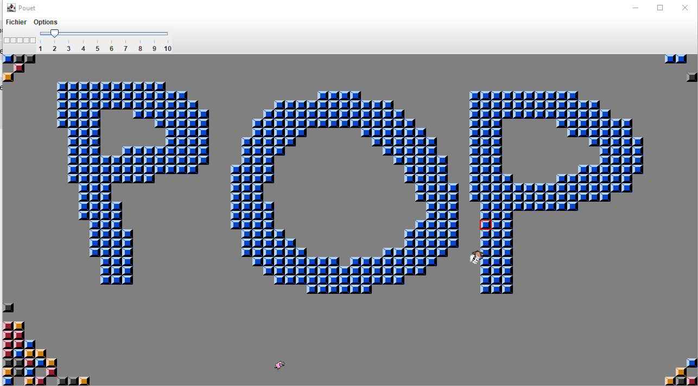

# Brick Game

This is a simple game made in Java in 2015 by me as I was learning the language.

In this game, two players can move in a 2D environment made of small bricks. Players can place or destroy bricks with their mouse.

## Controls

- Player 1: ZQSD
- Player 2: 8456

Each player is followed by an AI character that uses the A* algorithm to find the shortest path.

## Saving

The game includes a saving system that allows you to save and load levels created by placing or destroying bricks.

## Preview

